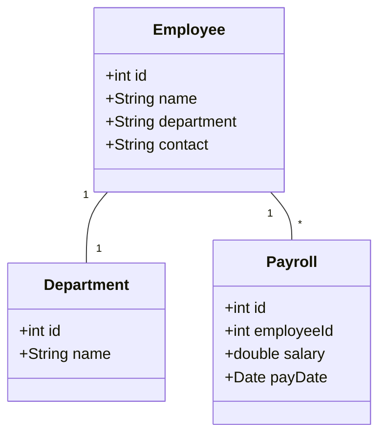

```mermaid
classDiagram
    class Employee {
        +int id
        +String name
        +String department
        +String contact
    }
    class Department {
        +int id
        +String name
    }
    class Payroll {
        +int id
        +int employeeId
        +double salary
        +Date payDate
    }
    Employee "1" -- "1" Department
    Employee "1" -- "*" Payroll
```